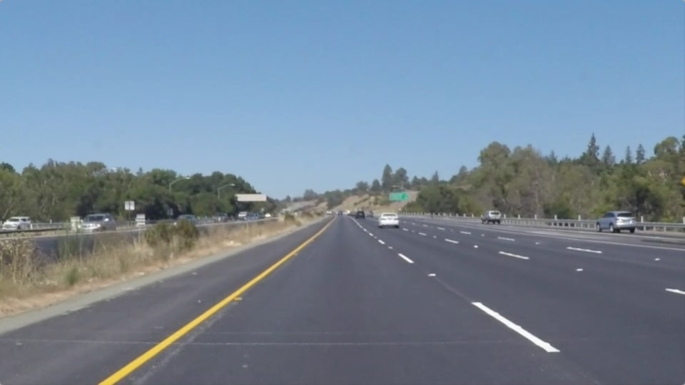

# **Finding Lane Lines on the Road**

Overview
---

In this project we will detect lane lines in images using Python and OpenCV.  OpenCV means "Open-Source Computer Vision", which is a package that has many useful tools for analyzing images. To identify, calculate and draw the lane line, we will use the following methods:

1. Canny Edge Detection
2. Hough Transform
3. Linear Regression

Requirements
---
* Python3
* OpenCV
* Scikit Learn
* Moviepy

How to use it
---

You can run the code in [lane_detection.ipynb](./lane_detection.ipynb) step by step.

For more information, you may read [writeup.md](./writeup.md)
