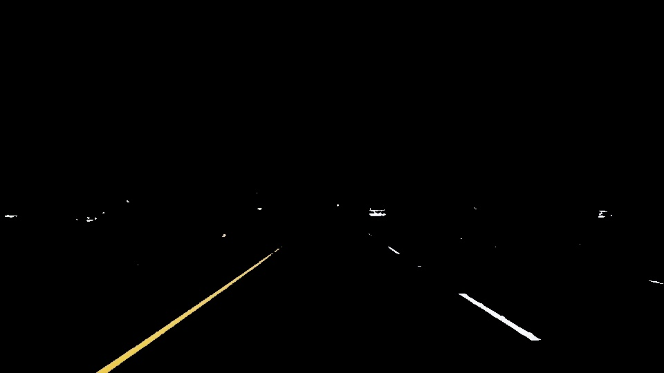
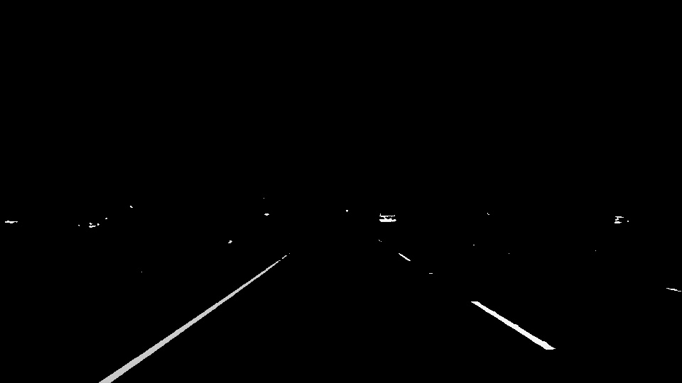
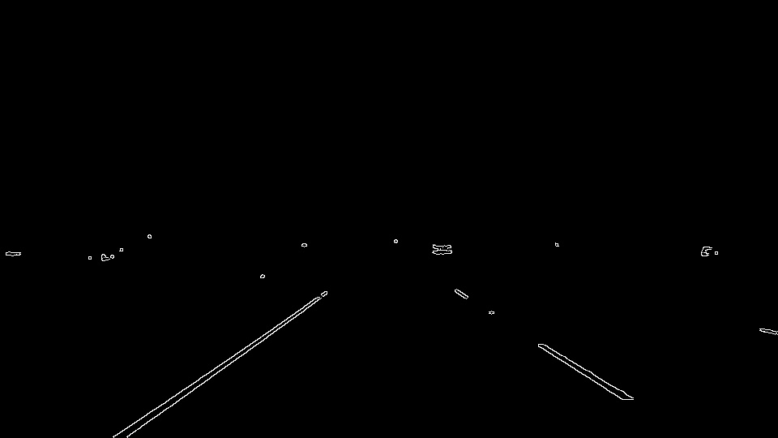
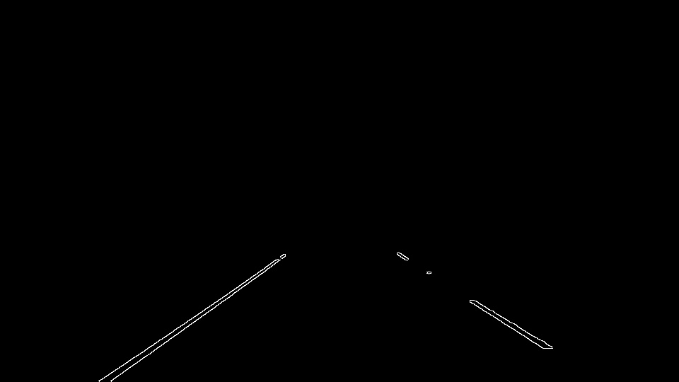
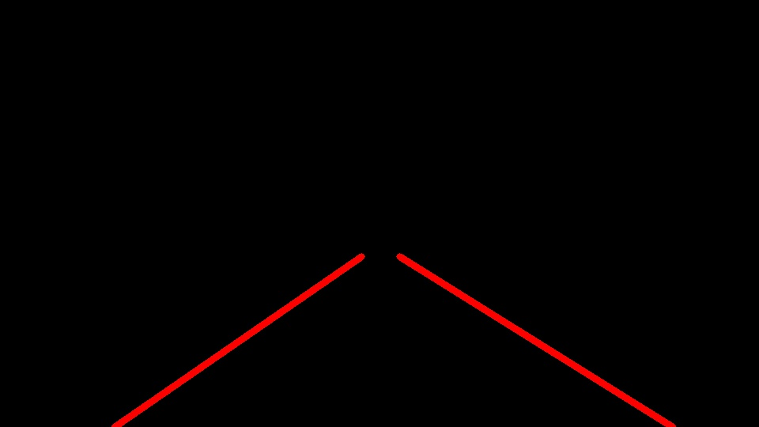
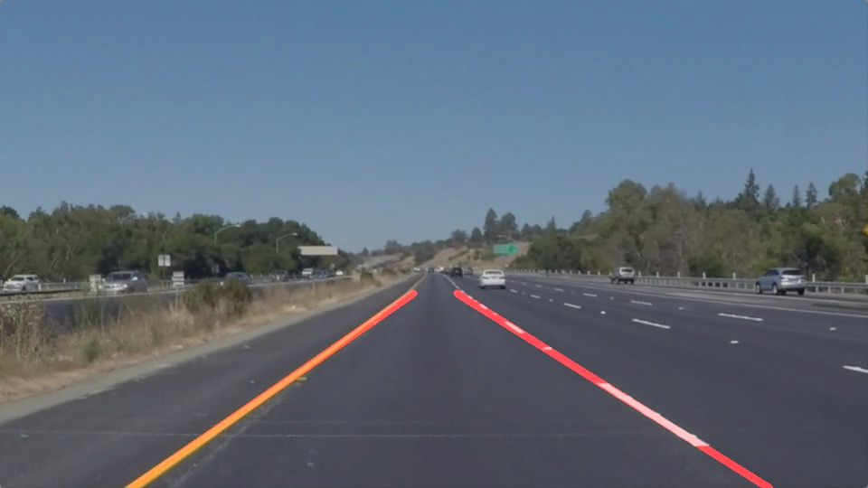

# **Finding Lane Lines on the Road**

---

### 1. Pipeline.

My pipeline consists of 6 steps.

**Step 1:** Extract the white and yellow color from the images based on RGB color space

The original image is as shown below.  

  \

We can find that the color of the lane is either yellow or white. So we can extract the yellow and white region from the picture based on the RGB color space.

Color | Channel R |Channel G |Channel B
------|-----------|----------|---------
Yellow| > 210 | 170 - 210| <140
White | > 222 | > 222 | > 222

After processing, the image is as shown below:

   

**Step 2:** Transform the color space of the image from RGB to grayscale

By using the function `grayscale()`, the processed image is as shown below:

   

**Step 3:** Smoothen the image using Gaussian filter

Using the function `gaussian_blur()`, the processed image is as shown below:

   

**Step 4:** Detect the edge in the image using Canny Edge Detection

Using the function `canny()`, the processed image is as shown below:

   

**Step 5:** Mask the image using a trapezoid

The masking function will extract the region of interest and eliminate the influence of the edges outside.

   

**Step 6:** Draw the line of the lanes

This step contains two parts. First, use Hough Transform to produce the candidate segments. Then produce two single lines based on the candidates.

In order to draw a single line on the left and right lanes, I modified the `draw_lines()` , the work flow of the function is as follows:

1. Calculate the slope and length of all the segments
2. Abandon the segments whose absolute value of the slope is bellow 0.5
3. Separate the lines into two groups "left" and "right" based on the signs of the slopes
4. Using the endpoints of the segments in each group for linear regression. The weight is the length of the segment which means the longer segment weights more in the regression  
5. Calculate the endpoints of the two single line
6. Combine the result of the current and previous frames together with the ratio alpha to smoothen the final lane lines in the time serial
7. Plot the lines

After processing, the image is as shown below:

   

Combine the lane line and the raw image together, I get the final result:

   

---

### 2. Potential shortcomings of the Pipeline

Although the algorithm works well with the three given videos there are still some potential shortcomings:

1. Fluctuation of the detected lane line: This only happens to the dash line side, especially when the car steers. If the angle of steering is too large, the lane line may fluctuate evidently.

2. Fail to extract the color or detect the edge due to different light and other conditions: When the weather and the objects change, the RGB value of the lane will change which may cause the failure of color extraction and edge detection. And if the lane was blocked by other things like cars, the detection will fail too.

3. Another shortcoming of the pipeline is that the algorithm is specially designed for this kind of road but not universally. When the color of the lane and road changes, the parameters in the function should also be changed.

---

### 3. Possible improvements to the pipeline

1. We may use polynomial rather than linear regression to fit the lane line. We can also use additional methods like Karman Filter to estimate the real position of the lane and reduce the fluctuation.

2. We may set a serial of parameters to detect the lane to cover most conditions and find out the confidence interval of the line to estimate the real position of the lane.

3. To design a universal algorithm to detect the lane, we may apply deep learning/machine learning method which may also solve the second issue.
